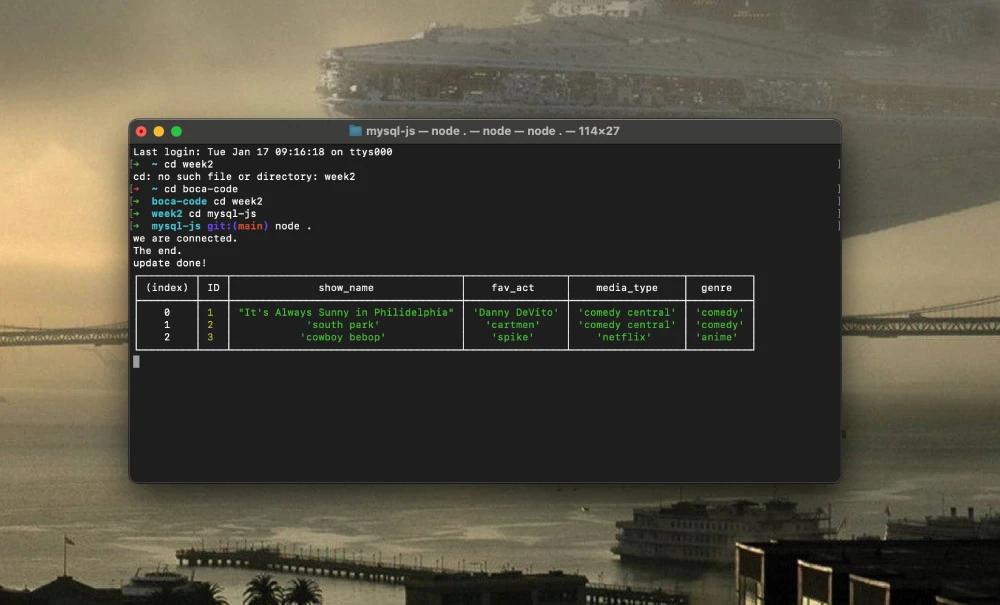

# MySQL with JavaScript     <!-- #H1  -->

Week 2, Day 2. Connecting MySQL with JavaScript using node.

## Lesson Learn
1. Node
2. NPM
3. MySQL
4. Secrets

See the demo [click here](https://github.com/andylinnell/mysql-js). <!-- BP = bracket parentheses  -->

